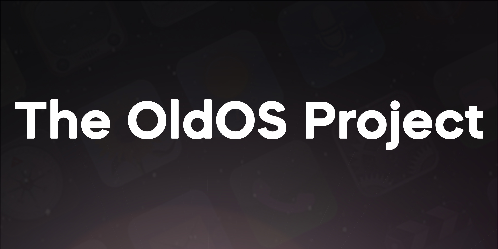
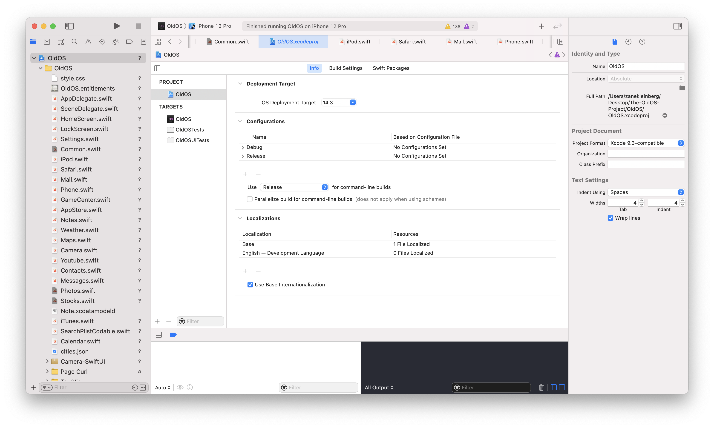
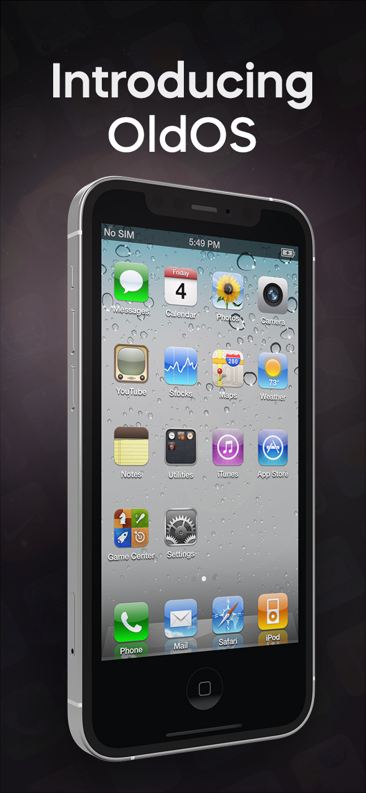
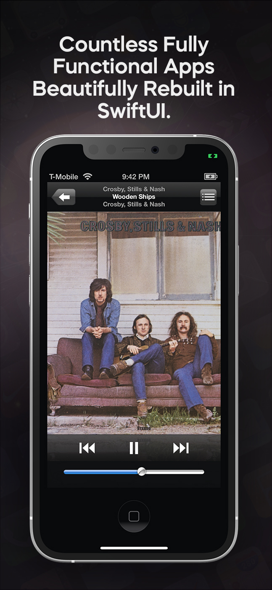
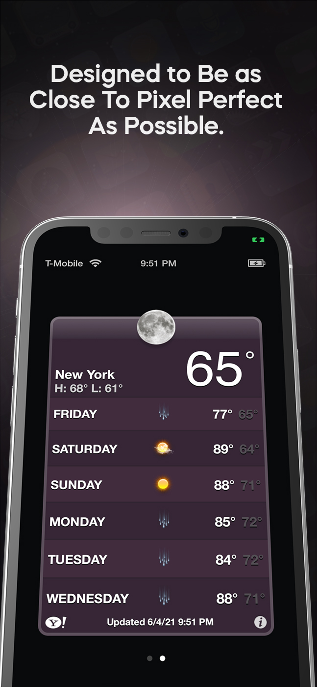
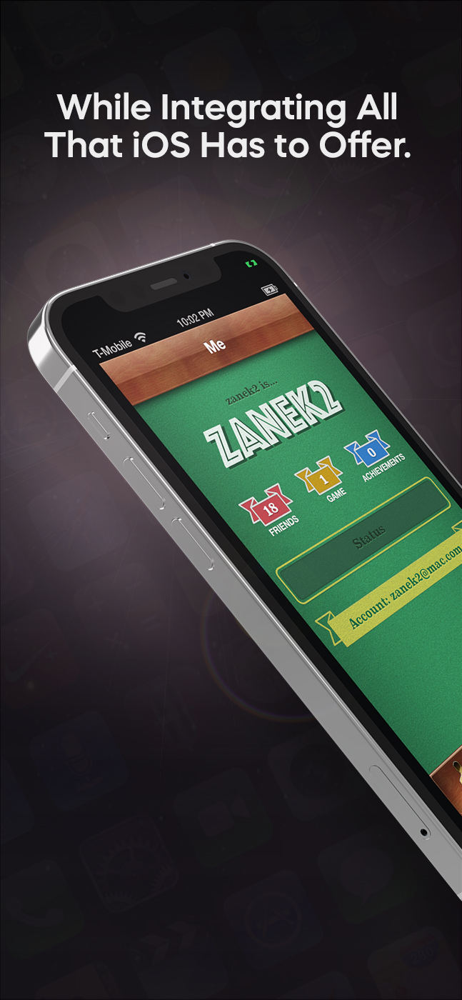
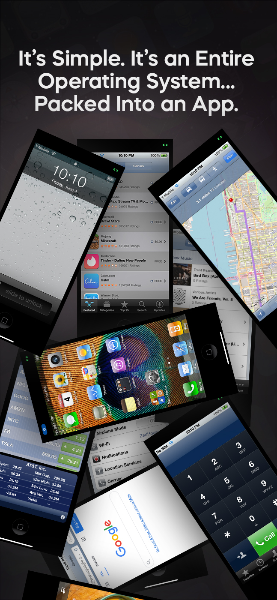

        
	
	
	

<table>
<tbody>
<td align="center">
 
<b>Updates: Version 1.0 is currently available 🎉</b> 
<small>This build can be built using any version of Xcode 12.5.x and below. Please do not build with Xcode 13. If you are on Monterey please see the "Building on Monterey" instructions.</small>

</td>
</tbody>
</table>

## What and Why?

> OldOS is a testament to the days of yesteryear, showcasing what iOS once was ten years ago. The ethos of the app is to merge the technologies of today with a pixel-perfect recreation of the user experience of the past. The vast majority of apps in OldOS are fully functional — meaning they seamlessly integrate with the data on your phone to deliver a live, emulator-esque experience. What does this mean? Well, you can play your music in iPod, get directions in Maps, surf the web in Safari, view the current weather in Weather, and much more. By the same token, no shortcuts were taken in fully fleshing out the operating system. You can change your background, adjust settings, search apps, et cetera. There are a few apps still not ready for primetime but don't worry, they're coming soon.
> 
> With OldOS, you no longer need to worry about securing a legacy iPhone to experience nostalgia — it's available on your daily driver.
> 
> Part of the goal with OldOS is to enable anyone to understand how iOS works and demonstrate just how powerful SwiftUI truly is. For that reason, the entire app is open-sourced — enabling developers to learn about, modify, and add to the app. I thought building this over my last six or so months in high school and sharing it with the world would be a fun and productive endeavor.

## What's Special

	* 🧑‍💻 Built almost entirely using SwiftUI.
	* 🎨 Designed to be as close to pixel-perfect as possible.
	* 📱 Fully functional, perhaps even usable as a second OS.
	* ❤️ A testament to the work of Apple employees of both the past and the present.
	* 🗺️ Fully open source for all to learn, modify, and build on.

## Where to Begin

The project is logically structured in files by app. Inside each app file, you'll see code and commentary behind it. Aside from main apps, there is the Common file. My mindset was to build the app in the same way Apple built interface builder — you have a collection of UI elements at your disposal that are bases. You can then make a copy in whatever other file you'd like if you require custom abilities. If you just need the generic version, you can use the generic. Hence, common, containing all your common UI elements. Lastly, there is HomeScreen, and LockScreen — essentially making up the Springboard. Lastly, in Assets.xcassets, you'll find all the image assets structured by app.

## Building on Monterey

For reasons unclear to me, Mac OS Moneterey <em>officially</em> drops support for Xcode 12. However, OldOS, for now, is only supported on Xcode 12. Fortunately for us we can get around this with a few easy steps.

	* Step 1: Open a terminal window.
	* Step 2: Type in <path to Xcode 12.5>/Contents/MacOS/Xcode and press enter. Xcode 12.5 should launch.
	* Step 3: Open OldOS via File->Open->OldOS.
	* That's it!
	

## Imagery

  
   
  
  
  

## Thanks

Thanks to all who decide to use, learn from, and modify this project. As well as all the creators of libraries imported. This was a  blast to create and I hope you enjoy it. I built this project while I had a little bit of time before college. If you enjoy it, please consider providing any little bit of support you can — it truly means a million.

 

## License
Creative Commons Attribution 4.0: [https://creativecommons.org/licenses/by/4.0/]()

